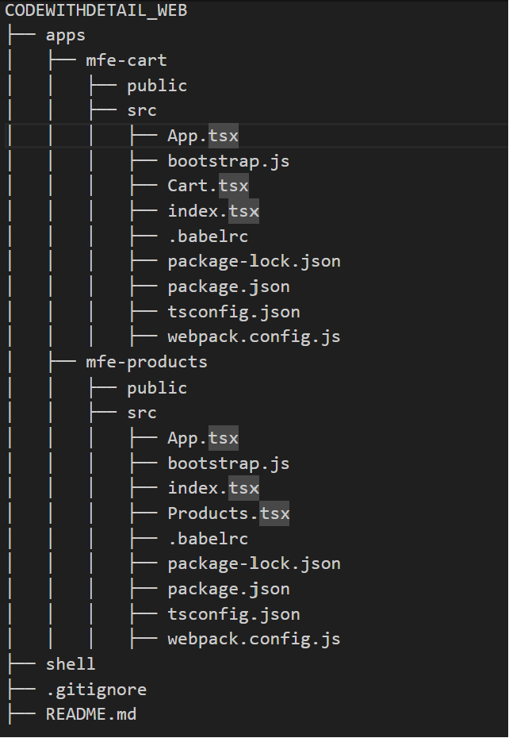

### Micro Front End Architecture - Folder Structure

## Tech Stack: React | Typescript | Webpack

# Step 1: npm install react react-dom

# Step 2: npm install --save-dev typescript

# Step 3: npm install --save-dev babel-loader @babel/core @babel/preset-env @babel/preset-react @babel/preset-typescript

# Step 4: npm install --save-dev webpack webpack-dev-server

# Step 5: npm install --save-dev html-webpack-plugin mini-css-extract-plugin css-loader

# Step 6: npm install --save-dev @types/react @types/react-dom --save-dev

## Example Webpack Configuration
# Shell Webpack Configuration
Refer to the webpack.config.js file in the shell directory for the configuration setup of the shell application.

# mfe-cart Webpack Configuration
Refer to the webpack.config.js file in the mfe-cart directory for the configuration setup of the cart microfrontend.

# mfe-products Webpack Configuration
Refer to the webpack.config.js file in the mfe-products directory for the configuration setup of the products microfrontend.